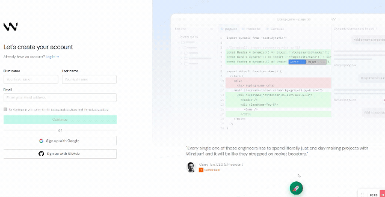

# 🚀 Signup Assistant - 自动注册助手

<p align="center">
  
  
  
</p>

<p align="center">
  
</p>

> 🎯 **全自动化** 账号注册浏览器插件，完全开源，无隐私问题。
>
> ⚠️ **声明**：本项目基于 [windsurf-helper-opensource](https://github.com/bjfwan/windsurf-helper-opensource) 二次开发，仅供学习研究使用。

---

## 🌟 核心优势

- **🤖 全自动化**：自动生成账号 → 自动填表 → 自动获取验证码 → 一键完成
- **🔒 安全可靠**：代码开源透明，数据本地存储，零隐私风险
- **⚡ 快速便捷**：3分钟开始使用，两种模式任选

---

## 🎯 两种使用模式

| 特性 | 🌍 临时邮箱模式 | 📧 自建API模式 |
|------|---------------|-------------|
| **配置难度** | ⭐ 极简 | ⭐⭐⭐ 中等 |
| **需要成本** | ✅ 免费 | ⚠️ 域名$10/年 |
| **稳定性** | ⚠️ 依赖公共API | ✅ 自己域名稳定 |
| **被封风险** | ⚠️ 可能被限制 | ✅ 基本不封 |
| **适用场景** | 测试使用 | 生产环境 |

---

## ⚠️ 重要说明

**本项目完全开源，不提供预配置服务**：
- ✅ 代码透明，无后门
- ✅ 数据自控，保护隐私
- ⚠️ 需要自己配置邮箱服务
- 📚 提供完整配置教程

---

## 🚀 快速开始

### 步骤1：下载项目

```bash
git clone https://github.com/jiuxiaying/signup-assistant.git
cd signup-assistant
```

### 步骤2：一键配置

**Windows**：双击 `setup.bat`  
**Mac/Linux**：运行 `./setup.sh`

### 步骤3：安装插件

1. 打开 Edge 浏览器（或 Chrome）
2. 访问 `edge://extensions/`
3. 打开"开发者模式"
4. 点击"加载已解压的扩展程序"
5. 选择 `extension` 文件夹

### 步骤4：配置邮箱服务（可选）

> 默认已配置 Mail.tm 临时邮箱，开箱即用。如需自定义，请参考以下选项。

#### 选项A：临时邮箱模式（推荐测试用）

**内置支持**：Mail.tm（推荐，已验证可用）

**配置步骤**：参考 [临时邮箱配置指南](./docs/temp-mail-setup.md)

#### 选项B：自建API模式（推荐生产用）

**前置要求**：域名、Cloudflare、QQ邮箱、Vercel

**配置步骤**：参考 [自建API配置指南](./docs/self-hosted-api.md)

### 步骤5：开始使用

1. 访问 https://windsurf.com/account/register
2. 点击插件图标
3. 点击"开始注册"
4. 等待自动完成

---

## 📚 详细文档

- 📖 [临时邮箱配置完整指南](./docs/temp-mail-setup.md)
- 📖 [自建API配置完整指南](./docs/self-hosted-api.md)

---

## 🔧 手动配置（可选）

### 创建配置文件

如果不使用 setup 脚本：

```bash
# Windows
copy extension\email-config.example.js extension\email-config.js
copy extension\config.example.js extension\config.js

# Mac/Linux
cp extension/email-config.example.js extension/email-config.js
cp extension/config.example.js extension/config.js
```

### 临时邮箱模式配置示例

编辑 `extension/email-config.js`：

```javascript
// ==================== 选择模式 ====================
const EMAIL_MODE = 'temp-mail';  // 临时邮箱模式

// ==================== 临时邮箱配置 ====================
const TEMP_MAIL_CONFIG = {
  provider: 'your-service',  // 您集成的服务名称
  pollInterval: 5000,        // 轮询间隔：5秒
  maxAttempts: 60            // 最大尝试次数：60次（5分钟）
};

// ==================== 导出配置 ====================
const EMAIL_CONFIG = {
  mode: EMAIL_MODE,
  tempMail: TEMP_MAIL_CONFIG,
  qqImap: QQ_IMAP_CONFIG,
  
  get prefix() {
    return this.mode === 'temp-mail' ? 'windsurf' : this.qqImap.emailPrefix;
  },
  get domain() {
    return this.mode === 'temp-mail' ? 'tempr.email' : this.qqImap.domain;
  }
};
```

### 自建API模式配置示例

编辑 `extension/email-config.js`：

```javascript
// ==================== 选择模式 ====================
const EMAIL_MODE = 'qq-imap';  // 自建API模式

// ==================== QQ邮箱配置 ====================
const QQ_IMAP_CONFIG = {
  domain: 'yourdomain.com',      // 您的域名
  emailPrefix: 'windsurf',       // 邮箱前缀
  apiBaseUrl: '',                // 留空
  apiKey: '',                    // 留空
  pollInterval: 5000,            // 轮询间隔
  timeout: 120000                // 超时时间：2分钟
};
```

编辑 `extension/config.js`：

```javascript
const API_CONFIG = {
  BASE_URL: 'https://your-project.vercel.app',  // 您的Vercel API地址
  API_KEY: '',                                   // 如果设置了密钥
  TIMEOUT: 10000,
  POLL_INTERVAL: 5000,
  ENDPOINTS: {
    HEALTH: '/api/health',
    START_MONITOR: '/api/start-monitor',
    CHECK_CODE: '/api/check-code',
    SAVE_ACCOUNT: '/api/accounts',
    UPDATE_ACCOUNT: '/api/accounts',
    DELETE_ACCOUNT: '/api/accounts',
    GET_ACCOUNTS: '/api/accounts'
  }
};
```

---

## 📁 项目结构

```
signup-assistant/
├── setup.bat/setup.sh         # 一键配置脚本
├── README.md                  # 项目说明
├── docs/                      # 详细文档
│   ├── temp-mail-setup.md    # 临时邮箱配置指南
│   └── self-hosted-api.md    # 自建API配置指南
└── extension/                 # 浏览器插件
    ├── manifest.json          # 插件清单
    ├── *.example.js          # 配置模板
    ├── popup/                # 弹出界面
    ├── content/              # 内容脚本
    ├── background/           # 后台服务
    └── utils/                # 工具库
```

---

## ✨ 功能特性

### 核心功能
- ✅ 自动生成账号信息
- ✅ 自动填写注册表单
- ✅ 自动获取验证码（5分钟内）
- ✅ 自动提交并完成注册

### 高级功能
- 🎯 智能状态机管理
- 💾 本地IndexedDB存储
- 🔄 会话断点续传
- 📊 账号管理面板
- 🐛 调试诊断工具

---

## ❓ 常见问题

### 基础问题

<details>
<summary><b>Q: 为什么不提供预配置服务？</b></summary>

**A:** 开源理念：代码透明、数据自控、不依赖他人服务器。

本项目坚持：
- ✅ 代码完全开源，用户可审查所有逻辑
- ✅ 数据由用户自己控制，不经过第三方
- ✅ 服务配置由用户自己选择，灵活可控
- ✅ 避免单点故障，不依赖作者的服务器

</details>

<details>
<summary><b>Q: 临时邮箱模式配置难吗？</b></summary>

**A:** 需要自己找到Windsurf接受的临时邮箱服务并集成，约需30分钟。

**步骤：**
1. 搜索并测试临时邮箱服务（10分钟）
2. 阅读该服务的API文档（5分钟）
3. 参考代码示例集成到插件（10分钟）
4. 测试验证功能是否正常（5分钟）

详见：[临时邮箱配置指南](./docs/temp-mail-setup.md)
</details>

<details>
<summary><b>Q: 自建API模式需要多少费用？</b></summary>

**A:** 仅需域名费用（~$10/年），其他服务均免费。

**费用明细：**
- 🌐 域名：~$10/年（必需）
- ☁️ Cloudflare：免费
- 🚀 Vercel：免费额度足够
- 📮 QQ邮箱：免费
- 🗄️ Supabase：免费额度足够

**总计：** ~$10/年（仅域名费用）
</details>

<details>
<summary><b>Q: 验证码如何自动获取？</b></summary>

**A:** 根据模式不同，自动获取方式不同：

**临时邮箱模式：**
1. 插件调用临时邮箱的公共API
2. 每5秒轮询一次，最多60次（5分钟）
3. 收到邮件后自动提取验证码
4. 显示在插件界面中

**自建API模式：**
1. 插件调用您部署的Vercel API
2. Vercel API通过IMAP连接QQ邮箱
3. 查询转发到QQ邮箱的验证码邮件
4. 提取验证码后返回给插件
5. 同时保存到Supabase数据库（可选）
</details>

<details>
<summary><b>Q: 数据存储在哪里？</b></summary>

**A:** 浏览器本地 IndexedDB，完全本地存储，不上传服务器。

**存储内容：**
- 账号信息（邮箱、密码、用户名）
- 验证码
- 注册时间
- 会话ID
- 临时邮箱token（如果使用临时邮箱模式）

**安全性：**
- ✅ 所有数据仅存储在浏览器本地
- ✅ 不会上传到任何服务器
- ✅ 配置文件已被 .gitignore 忽略
- ✅ 可以随时在账号管理页面删除
</details>

<details>
<summary><b>Q: 配置文件会被上传吗？</b></summary>

**A:** 不会！`.gitignore` 已忽略所有配置文件。

**被忽略的文件：**
```
extension/email-config.js
extension/config.js
```

这些文件只在您本地存在，不会被Git跟踪，确保隐私安全。
</details>

### 故障排除

<details>
<summary><b>Q: 插件报错怎么办？</b></summary>

**A:** 点击插件 🧠 图标查看诊断报告。

**常见错误及解决方案：**

1. **缺少配置文件**
   - 错误：`EMAIL_CONFIG is not defined`
   - 解决：运行 `setup.bat` 或 `setup.sh`

2. **API连接失败**
   - 错误：`fetch failed` 或 `404`
   - 解决：检查 `config.js` 中的 `BASE_URL` 是否正确

3. **临时邮箱服务不可用**
   - 错误：`无法生成邮箱` 或 `403 Forbidden`
   - 解决：更换其他临时邮箱服务

4. **状态机转换错误**
   - 错误：`非法状态转换`
   - 解决：点击"停止监控"按钮重置状态

5. **验证码获取超时**
   - 错误：`未收到验证码`
   - 解决：
     - 临时邮箱模式：确认邮箱服务可用
     - 自建API模式：检查Vercel API和QQ邮箱配置
</details>

<details>
<summary><b>Q: 如何调试插件？</b></summary>

**A:** 多种调试方法可用：

**方法1：使用内置诊断工具**
1. 点击插件图标
2. 点击 🧠 图标
3. 查看健康检查报告

**方法2：查看浏览器控制台**
1. 右键插件图标
2. 选择"检查"或"审查元素"
3. 切换到 Console 标签
4. 查看详细日志输出

**方法3：查看调试面板**
1. 打开账号管理页面
2. 点击右下角"🐛 调试"按钮
3. 查看实时日志
4. 点击"📋 复制"导出日志

**方法4：查看背景页日志**
1. 访问 `edge://extensions/`
2. 找到插件，点击"服务工作线程"
3. 查看后台脚本日志
</details>

<details>
<summary><b>Q: 如何更新插件？</b></summary>

**A:** 按以下步骤更新：

1. **备份配置文件**
   ```bash
   # 备份您的配置
   copy extension\email-config.js email-config.backup.js
   copy extension\config.js config.backup.js
   ```

2. **拉取最新代码**
   ```bash
   git pull origin main
   ```

3. **恢复配置文件**
   ```bash
   copy email-config.backup.js extension\email-config.js
   copy config.backup.js extension\config.js
   ```

4. **重新加载插件**
   - 访问 `edge://extensions/`
   - 点击插件的 🔄 刷新图标

</details>

<details>
<summary><b>Q: 支持哪些浏览器？</b></summary>

**A:** 支持所有基于Chromium的浏览器：

- ✅ Microsoft Edge（推荐）
- ✅ Google Chrome
- ✅ Brave Browser
- ✅ Opera
- ✅ Vivaldi
- ❌ Firefox（暂不支持，API不兼容）
- ❌ Safari（暂不支持）
</details>

<details>
<summary><b>Q: 可以同时注册多个账号吗？</b></summary>

**A:** 可以，但需要注意：

**单个标签页：** 一次只能注册一个账号

**多个标签页：** 理论上可以同时注册，但不推荐：
- ⚠️ 可能触发Windsurf的频率限制
- ⚠️ 临时邮箱服务可能有请求限制
- ⚠️ 状态管理可能冲突

**推荐做法：**
1. 一个接一个注册
2. 等待每个账号完成后再开始下一个
3. 使用账号管理页面批量管理
</details>

---

## 🛠️ 开发指南

### 重新加载插件
`edge://extensions/` → 点击插件的 🔄 图标

### 查看调试日志
右键插件图标 → 检查 → Console 标签

### 参与贡献
欢迎提交 Bug、功能建议或 Pull Request

---

## 🤝 贡献

Fork → 创建分支 → 提交更改 → Push → 发起 Pull Request

我们欢迎：
- 🐛 Bug 报告
- 💡 功能建议
- 📖 文档改进
- 🔧 代码贡献
- 📣 项目推广

---

## 📜 许可证

MIT License © 2025 jiuxiaying

本项目基于开源项目进行二次开发。

本项目采用 MIT 许可证，允许：
- ✅ 免费使用
- ✅ 修改源代码
- ❌ **禁止商业使用**
- ✅ 私有部署（仅限个人学习）
- ✅ 重新分发（需保留原作者信息）

> ⚠️ **特别说明**：本二次开发版本**明确禁止任何商业用途**。

---

## ⚠️ 免责声明

**重要提示：请在使用前仔细阅读**

1. **学习研究目的**：本工具仅供个人学习、研究和技术交流使用，不得用于任何商业用途或非法目的。

2. **遵守服务条款**：使用本工具前，请确保您已阅读并同意目标平台的服务条款。任何违反其服务条款的行为由使用者自行承担责任。

3. **风险自担**：使用本工具可能导致账号被封禁或其他后果，所有风险由使用者自行承担。作者不对任何直接或间接损失负责。

4. **无担保声明**：本软件按"现状"提供，不提供任何明示或暗示的担保，包括但不限于适销性、特定用途适用性的担保。

5. **二次开发声明**：本项目基于开源项目进行二次开发，遵循 MIT 开源协议。

**继续使用即表示您已阅读、理解并同意以上声明。**

---

## 📞 联系方式

- 🐙 GitHub: [@jiuxiaying](https://github.com/jiuxiaying)
- 🐛 Issues: [提交问题](https://github.com/jiuxiaying/signup-assistant/issues)

---

## 🙏 致谢

感谢以下开源项目和服务：

- [Mail.tm](https://mail.tm/) - 临时邮箱服务
- [MailDrop](https://maildrop.cc/) - 临时邮箱服务
- [Cloudflare](https://cloudflare.com/) - DNS 和邮件转发服务
- [Vercel](https://vercel.com/) - 免费托管平台
- [Supabase](https://supabase.com/) - 开源 Firebase 替代品

感谢所有贡献者和用户的支持！

---

<p align="center">
  ⭐ 如果这个项目对您有帮助，请给它一个 Star！
</p>

<p align="center">
  Made with ❤️ by <a href="https://github.com/jiuxiaying">jiuxiaying</a>
</p>
